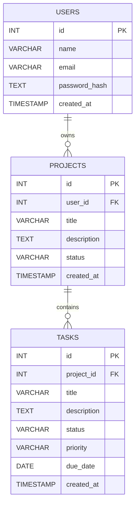

# 🗂️ PERN Project Management App

A full-stack project management application built with PostgreSQL, Express, React, and Node.js.

---

## 🚀 Live Demo
- **Frontend:** https://checkpoint-hazel.vercel.app/
- **Backend API:** https://checkpoint-backend-83z1.onrender.com/

---

## 🛠️ Tech Stack
- **Database:** PostgreSQL
- **Backend:** Node.js, Express, JWT, bcrypt
- **Frontend:** React (Vite), React Router v6, Axios, Tailwind CSS
- **Deploy:** Render (API) + Vercel (Client)

---

## 🗃️ Database Schema



---

## 📡 API Endpoints

### Auth
| Method | Route | Description |
|--------|-------|-------------|
| POST | `/api/auth/register` | Register new user |
| POST | `/api/auth/login` | Login & receive JWT |
| GET | `/api/auth/me` | Get current user |

### Projects
| Method | Route | Description |
|--------|-------|-------------|
| GET | `/api/projects` | Get all projects |
| GET | `/api/projects/:id` | Get single project |
| POST | `/api/projects` | Create project |
| PUT | `/api/projects/:id` | Update project |
| DELETE | `/api/projects/:id` | Delete project |

### Tasks
| Method | Route | Description |
|--------|-------|-------------|
| GET | `/api/projects/:id/tasks` | Get tasks for project |
| POST | `/api/projects/:id/tasks` | Create task |
| PUT | `/api/tasks/:id` | Update task |
| DELETE | `/api/tasks/:id` | Delete task |

---

## ⚙️ Local Setup

### Prerequisites
- Node.js v18+
- PostgreSQL 14+

### Backend
```bash
cd server
npm install
cp .env.example .env   # fill in your values
npm run dev
```

### Frontend
```bash
cd client
npm install
cp .env.example .env   # set VITE_API_URL
npm run dev
```

### Environment Variables

**server/.env**
```
DATABASE_URL=postgresql://localhost:5432/pern_pm
PORT=5000
JWT_SECRET=your_secret_key_here
CLIENT_URL=http://localhost:5173
VERCEL_FRONTEND_URL=https://checkpoint-hazel.vercel.app/
ALLOWED_ORIGINS=https://checkpoint-hazel.vercel.app/
```

**client/.env**
```
VITE_API_URL=http://localhost:5001
```

---

## 📁 Project Structure

```
checkpoint/
├── client/                  # React frontend (Vite)
│   ├── src/
│   │   ├── components/
│   │   ├── context/
│   │   ├── api/
│   │   └── main.jsx
│   └── package.json
├── server/                  # Express backend
│   ├── controllers/
│   ├── middleware/
│   ├── routes/
│   ├── db/
│   │   ├── index.js
│   │   └── schema.sql
│   └── app.js
```

---

## 🌐 Deployment

### Backend (Render)
- Deploy from GitHub, set root to `server/`
- Add all environment variables from `.env.example` in Render dashboard
- Live URL: https://checkpoint-backend-83z1.onrender.com/

### Frontend (Vercel)
- Deploy from GitHub, set root to `client/`
- Add `VITE_API_URL` in Vercel dashboard (point to Render backend)
- Live URL: https://checkpoint-hazel.vercel.app/

---

## 📝 License

MIT
│   └── package.json
└── README.md
```


---

## 🤝 Contributing
Pull requests are welcome. For major changes, please open an issue first to discuss what you would like to change.

## 📄 License
[MIT](LICENSE)